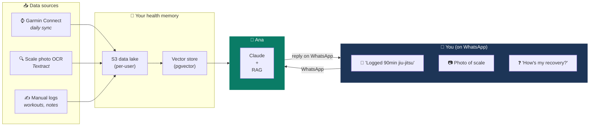

# Meet Ana

## Your health coach lives in WhatsApp.

No app to install. No dashboard to learn. No charts to decode.

Just a conversation.

> *"Ana, I just finished a 1h30 jiu-jitsu session."*
> *"Ana, here's a photo of my scale — log it."*
> *"Ana, how was my recovery this week compared to last month?"*

Ana answers. In seconds. With context from years of your own health data.

---

## The problem

You already wear a Garmin. You already step on a smart scale. You already train hard.

But the data lives in five different apps. The insights never come. And when they do, they're a chart you have to interpret yourself.

**Health data is everywhere. Health understanding is nowhere.**

---

## The pitch

Ana is a personal AI health assistant that lives entirely inside WhatsApp.

She **silently ingests** your Garmin data every night, **reads photos** of your smart-scale display, **logs workouts** the apps don't track (jiu-jitsu, surfing, anything), and **answers questions** about your trends, recovery and performance — in plain language, on the channel you already use every day.

No new app. No new tab. No new habit.

---

## How it works

A typical day:

1. **06:00 UTC** — Ana quietly pulls last night's sleep, HRV, training load and steps from Garmin.
2. **Morning** — You weigh yourself, snap the display, send the photo to Ana on WhatsApp. She extracts weight, body-fat %, BMI.
3. **Evening** — You finish jiu-jitsu and message *"90 min rolling, high intensity"*. Ana logs it.
4. **Sunday** — You ask *"how did this week compare to last?"* and get a conversational answer grounded in your actual data.

You never open a dashboard. Because there isn't one.

---

## What makes Ana different

| | Typical fitness app | **Ana** |
|---|---|---|
| Where it lives | Yet another app | WhatsApp — already on your phone |
| Interface | Charts, rings, scores | Plain conversation |
| Manual logging | Forms, dropdowns, taps | One sentence in a chat |
| Scale data | Type it in | Send a photo |
| Insights | You interpret | She explains |
| Data ownership | Vendor cloud | Your own AWS account |

---

## Who it's for

Ana is built **for one user first** — me. Then for a tight circle of family and close friends. Never as a public SaaS.

That constraint is a feature: it lets the product stay opinionated, private and cheap to run, without compromising on production-grade engineering.

---

## The project behind the product

AnalyticsHealth is also a **learning vehicle**. I'm a [solutions architect](https://www.linkedin.com/in/lucassimoes/) with a deep athletic background (jiu-jitsu black belt, marathoner, multi-sport for life) and I'm building Ana to develop hands-on expertise in three things at once:

- **Applied AI** — a real RAG pipeline on Amazon Bedrock, with Claude as the reasoning engine
- **Production-grade AWS architecture** — 100% IaC (CDK + SAM), GitHub OIDC, Landing Zone with SSO, Well-Architected from day one
- **A real product with real data** — years of my own Garmin history, my own weight measurements, my own training. No synthetic datasets, no toy problems.

The name **Ana** is a tribute to my wife, [**Ana Paula**](https://www.linkedin.com/in/anapaulamoraissilva/) — and a natural acronym of **Ana**lyticsHealth.

---

## What this is not

- ❌ A public SaaS or commercial product
- ❌ A mobile app or a web dashboard
- ❌ A medical or clinically certified system
- ❌ A real-time analytics platform (D-1 data is fine)

---

## Guiding principles

| Principle | What it means in practice |
|---|---|
| **Conversation-only** | If it can't be done in a WhatsApp message, it doesn't ship |
| **Idle cost ≈ $0** | Pay-per-use everywhere; nothing always-on while not in use |
| **Your data, your account** | Single-tenant by design; `user_id` from JWT, never from request body |
| **Real data, real trade-offs** | Privacy, idempotency, cost and failure tolerance are first-class concerns |
| **Documented decisions** | Every meaningful choice has an ADR alongside the code |
